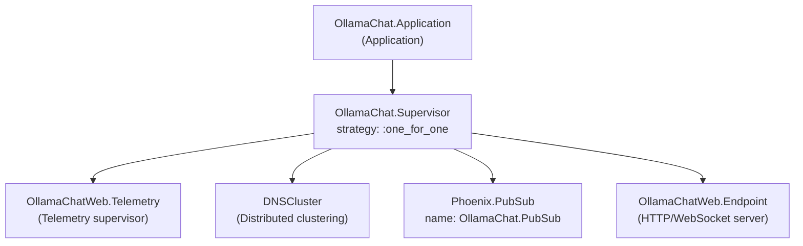

# OTP Supervision Tree

The application uses a `:one_for_one` supervision strategy — if any child crashes, only that child is restarted.

There is no database supervisor or GenServer processes — `OllamaClient` is a stateless module with plain functions, not a supervised process.
