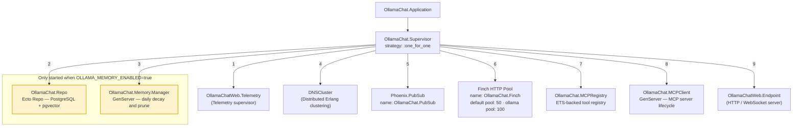

# OTP Supervision Tree

The application uses a `:one_for_one` supervision strategy — if any child crashes, only that child is restarted independently. Children are started in the numbered order shown below.

Children **2 and 3** are only added to the supervision tree when `OLLAMA_MEMORY_ENABLED=true`.

```mermaid
graph TD
    App["OllamaChat.Application"] --> Sup["OllamaChat.Supervisor<br/>strategy: :one_for_one"]

    Sup -->|"1"| Tel["OllamaChatWeb.Telemetry<br/>(Telemetry supervisor)"]

    subgraph cond["Only started when OLLAMA_MEMORY_ENABLED=true"]
        Repo["OllamaChat.Repo<br/>Ecto Repo — PostgreSQL + pgvector"]
        Mgr["OllamaChat.Memory.Manager<br/>GenServer — daily decay and prune"]
    end

    Sup -->|"2"| Repo
    Sup -->|"3"| Mgr

    Sup -->|"4"| DNS["DNSCluster<br/>(Distributed Erlang clustering)"]

    Sup -->|"5"| PubSub["Phoenix.PubSub<br/>name: OllamaChat.PubSub"]

    Sup -->|"6"| Finch["Finch HTTP Pool<br/>name: OllamaChat.Finch<br/>default pool: 50 · ollama pool: 100"]

    Sup -->|"7"| MCPReg["OllamaChat.MCPRegistry<br/>ETS-backed tool registry"]

    Sup -->|"8"| MCPCli["OllamaChat.MCPClient<br/>GenServer — MCP server lifecycle"]

    Sup -->|"9"| Endpoint["OllamaChatWeb.Endpoint<br/>(HTTP / WebSocket server)"]

    classDef conditional fill:#fff3cd,stroke:#e6a817,stroke-width:2px
    class Repo,Mgr conditional
```

## Notes

| Child | Type | Purpose |
|---|---|---|
| `OllamaChatWeb.Telemetry` | Supervisor | Attaches telemetry handlers and metrics reporters |
| `OllamaChat.Repo` *(conditional)* | Ecto Repo | PostgreSQL connection pool; requires pgvector extension |
| `OllamaChat.Memory.Manager` *(conditional)* | GenServer | Runs scheduled maintenance: daily importance decay and low-value memory pruning |
| `DNSCluster` | Worker | Discovers peers via DNS for distributed Erlang |
| `Phoenix.PubSub` | Supervisor | In-process broadcast bus used by LiveView |
| `Finch` | Supervisor | HTTP connection pools — general (50) and Ollama-specific (100) |
| `OllamaChat.MCPRegistry` | ETS owner | Stores discovered MCP tools; owned (and repopulated) by `MCPClient` |
| `OllamaChat.MCPClient` | GenServer | Manages external MCP server processes, tool discovery, and crash recovery |
| `OllamaChatWeb.Endpoint` | Supervisor | Accepts HTTP and WebSocket connections; started last so all services are ready |

`OllamaChat.OllamaClient` is **not** a supervised process — it is a stateless module of plain functions that makes HTTP calls through the `Finch` pool.