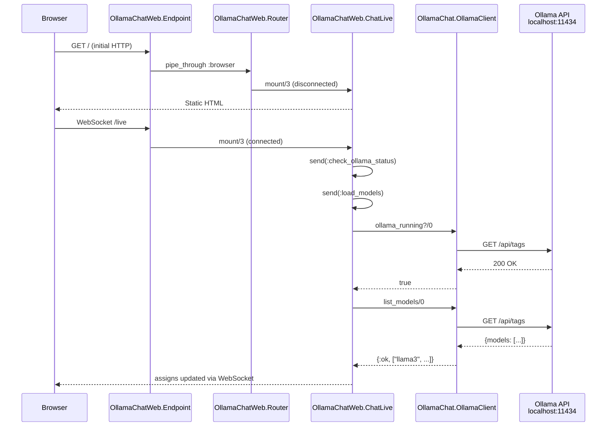

# HTTP/WebSocket Request Flow

All user interaction goes through a single LiveView mounted at `/`. Static assets are served by `Plug.Static`.

The Endpoint plug pipeline: `Plug.Static` → `LiveReloader` (dev) → `RequestId` → `Telemetry` → `Parsers` → `MethodOverride` → `Head` → `Session` → `Router`.
