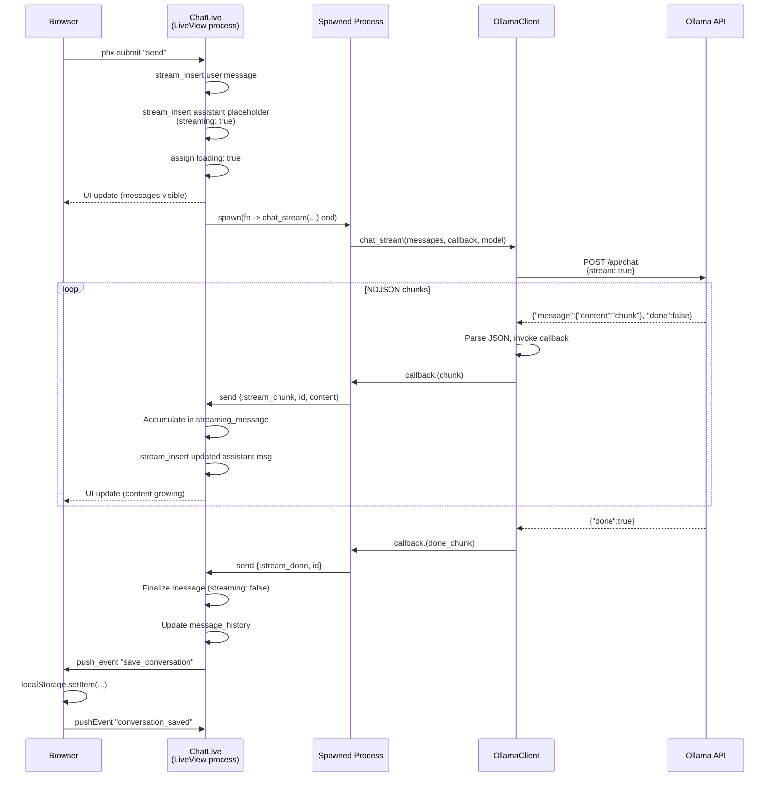

# Chat Streaming Flow

When the user sends a message, a spawned process streams NDJSON chunks from Ollama back to the LiveView via message passing.

Key design decisions:
- Streaming runs in a **spawned process** to avoid blocking the LiveView
- Content is **accumulated** in `streaming_message` assign and re-inserted into the stream on each chunk
- On completion, the conversation is **auto-saved to browser localStorage** via a `push_event`
