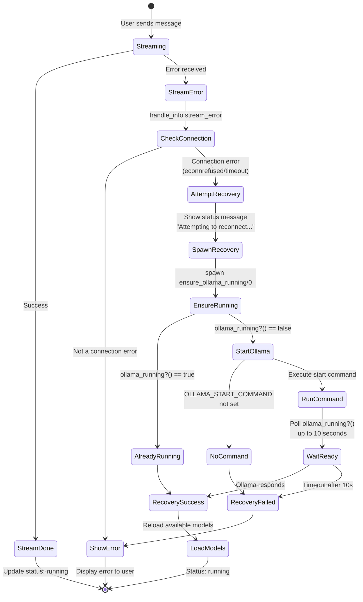

# Error Recovery Flow

Connection failures trigger automatic Ollama restart attempts when `OLLAMA_START_COMMAND` is configured.

Recovery happens in two layers:
1. **OllamaClient level**: `chat/2` and `chat_stream/3` detect `:econnrefused`, call `ensure_ollama_running/0`, sleep 2s, then retry
2. **ChatLive level**: `{:stream_error, ...}` triggers `{:attempt_recovery, ...}` which spawns a recovery process and updates UI status
