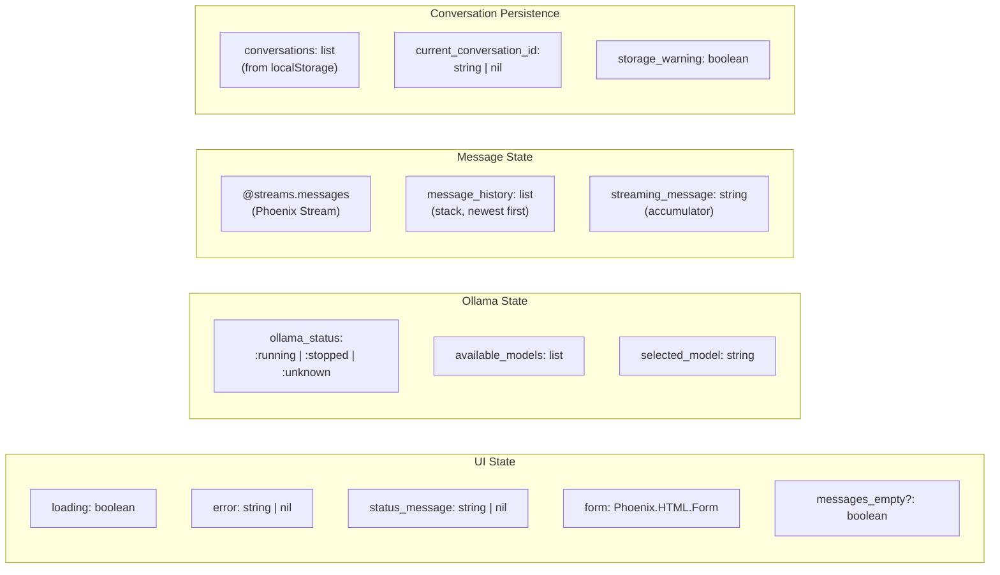
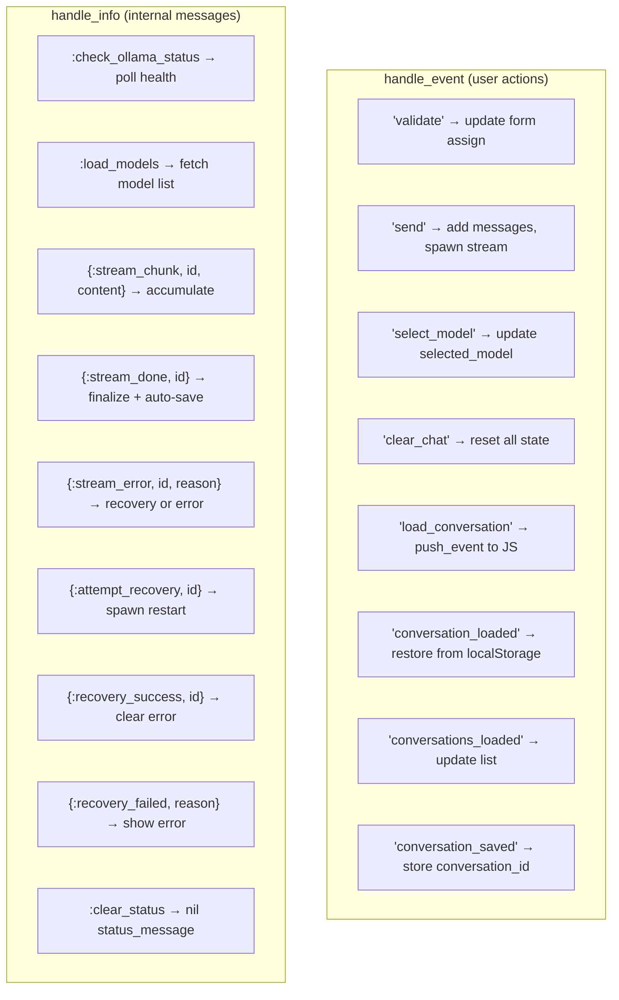
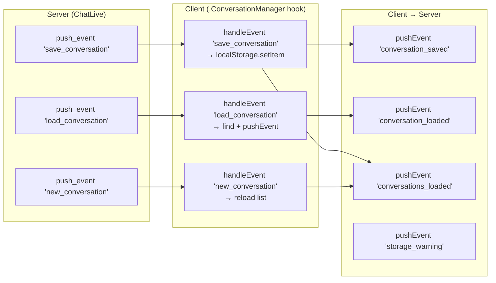

# ChatLive State & Event Map

## Socket Assigns

## Event Handlers

## Client ↔ Server Event Bridge

Conversation persistence uses `push_event` / `pushEvent` to bridge LiveView and browser localStorage:

