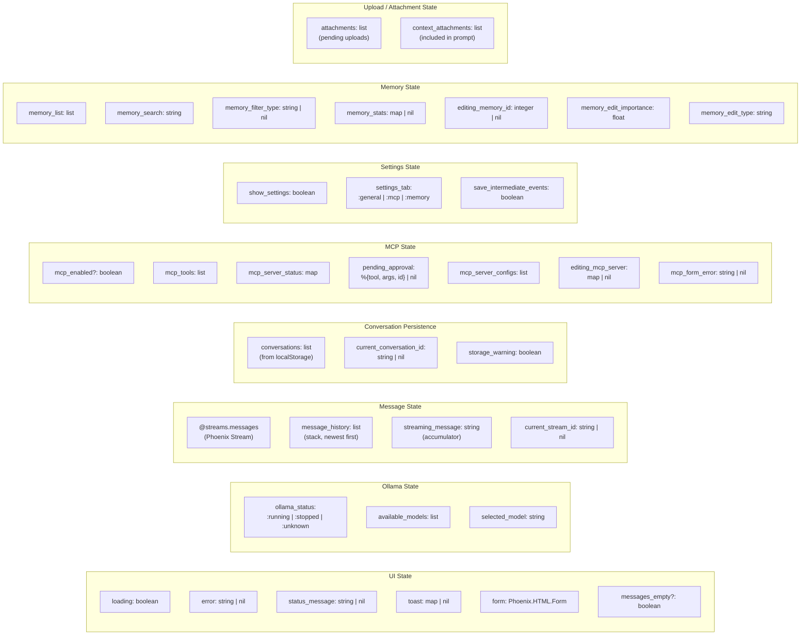
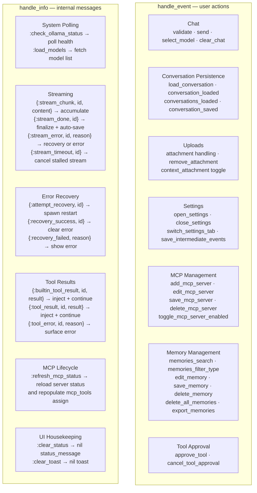
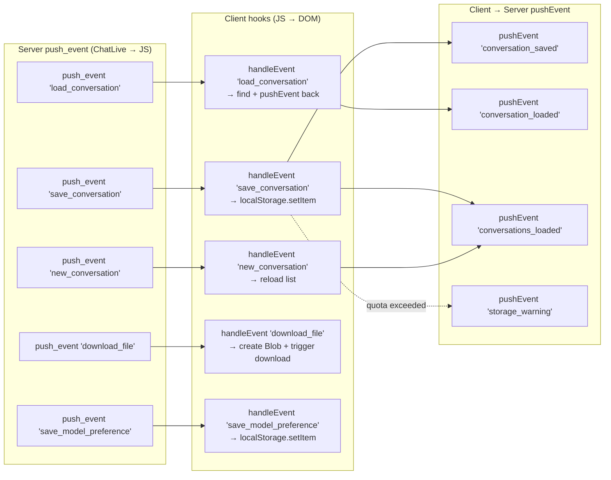

# ChatLive State & Event Map

## Socket Assigns

```mermaid
graph LR
    subgraph "UI State"
        loading["loading: boolean"]
        error["error: string | nil"]
        status["status_message: string | nil"]
        toast["toast: map | nil"]
        form["form: Phoenix.HTML.Form"]
        empty["messages_empty?: boolean"]
    end

    subgraph "Ollama State"
        ollama_status["ollama_status:<br/>:running | :stopped | :unknown"]
        models["available_models: list"]
        selected["selected_model: string"]
    end

    subgraph "Message State"
        stream["@streams.messages<br/>(Phoenix Stream)"]
        history["message_history: list<br/>(stack, newest first)"]
        streaming["streaming_message: string<br/>(accumulator)"]
        stream_id["current_stream_id: string | nil"]
    end

    subgraph "Conversation Persistence"
        convos["conversations: list<br/>(from localStorage)"]
        current_id["current_conversation_id:<br/>string | nil"]
        warning["storage_warning: boolean"]
    end

    subgraph "MCP State"
        mcp_enabled["mcp_enabled?: boolean"]
        mcp_tools["mcp_tools: list"]
        mcp_status["mcp_server_status: map"]
        pending["pending_approval:<br/>%{tool, args, id} | nil"]
        mcp_configs["mcp_server_configs: list"]
        editing_mcp["editing_mcp_server:<br/>map | nil"]
        mcp_err["mcp_form_error: string | nil"]
    end

    subgraph "Settings State"
        show_settings["show_settings: boolean"]
        settings_tab["settings_tab:<br/>:general | :mcp | :memory"]
        save_intermediate["save_intermediate_events: boolean"]
    end

    subgraph "Memory State"
        mem_list["memory_list: list"]
        mem_search["memory_search: string"]
        mem_filter["memory_filter_type: string | nil"]
        mem_stats["memory_stats: map | nil"]
        editing_mem["editing_memory_id: integer | nil"]
        mem_importance["memory_edit_importance: float"]
        mem_type["memory_edit_type: string"]
    end

    subgraph "Upload / Attachment State"
        attachments["attachments: list<br/>(pending uploads)"]
        ctx_attachments["context_attachments: list<br/>(included in prompt)"]
    end
```

## Event Handlers

```mermaid
graph TD
    subgraph HE["handle_event — user actions"]
        HE1["Chat<br/>validate · send · select_model · clear_chat"]
        HE2["Conversation Persistence<br/>load_conversation · conversation_loaded<br/>conversations_loaded · conversation_saved"]
        HE3["Uploads<br/>attachment handling · remove_attachment<br/>context_attachment toggle"]
        HE4["Settings<br/>open_settings · close_settings<br/>switch_settings_tab · save_intermediate_events"]
        HE5["MCP Management<br/>add_mcp_server · edit_mcp_server<br/>save_mcp_server · delete_mcp_server<br/>toggle_mcp_server_enabled"]
        HE6["Memory Management<br/>memories_search · memories_filter_type<br/>edit_memory · save_memory · delete_memory<br/>delete_all_memories · export_memories"]
        HE7["Tool Approval<br/>approve_tool · cancel_tool_approval"]
    end

    subgraph HI["handle_info — internal messages"]
        HI1["System Polling<br/>:check_ollama_status → poll health<br/>:load_models → fetch model list"]
        HI2["Streaming<br/>{:stream_chunk, id, content} → accumulate<br/>{:stream_done, id} → finalize + auto-save<br/>{:stream_error, id, reason} → recovery or error<br/>{:stream_timeout, id} → cancel stalled stream"]
        HI3["Error Recovery<br/>{:attempt_recovery, id} → spawn restart<br/>{:recovery_success, id} → clear error<br/>{:recovery_failed, reason} → show error"]
        HI4["Tool Results<br/>{:builtin_tool_result, id, result} → inject + continue<br/>{:tool_result, id, result} → inject + continue<br/>{:tool_error, id, reason} → surface error"]
        HI5["MCP Lifecycle<br/>:refresh_mcp_status → reload server status<br/>and repopulate mcp_tools assign"]
        HI6["UI Housekeeping<br/>:clear_status → nil status_message<br/>:clear_toast → nil toast"]
    end
```

## Client ↔ Server Event Bridge

Conversation persistence uses `push_event` / `pushEvent` to bridge LiveView and browser localStorage. Additional hooks handle file downloads and model preference persistence.

```mermaid
graph LR
    subgraph Server["Server push_event (ChatLive → JS)"]
        PE1["push_event 'save_conversation'"]
        PE2["push_event 'load_conversation'"]
        PE3["push_event 'new_conversation'"]
        PE4["push_event 'download_file'"]
        PE5["push_event 'save_model_preference'"]
    end

    subgraph ClientHooks["Client hooks (JS → DOM)"]
        HE1["handleEvent 'save_conversation'<br/>→ localStorage.setItem"]
        HE2["handleEvent 'load_conversation'<br/>→ find + pushEvent back"]
        HE3["handleEvent 'new_conversation'<br/>→ reload list"]
        HE4["handleEvent 'download_file'<br/>→ create Blob + trigger download"]
        HE5["handleEvent 'save_model_preference'<br/>→ localStorage.setItem"]
    end

    subgraph ClientToServer["Client → Server pushEvent"]
        CE1["pushEvent 'conversation_saved'"]
        CE2["pushEvent 'conversation_loaded'"]
        CE3["pushEvent 'conversations_loaded'"]
        CE4["pushEvent 'storage_warning'"]
    end

    PE1 --> HE1
    PE2 --> HE2
    PE3 --> HE3
    PE4 --> HE4
    PE5 --> HE5

    HE1 --> CE1
    HE1 --> CE3
    HE2 --> CE2
    HE3 --> CE3
    HE1 -.->|"quota exceeded"| CE4
```

| Hook | Attached to | Purpose |
|---|---|---|
| `.ConversationManager` | conversation list element | Read/write conversations in `localStorage`; bridges server commands to JS storage API |
| `.MemoryDownload` | memory export button | Receives `download_file` push event; creates an in-memory `Blob` and triggers a browser download |
| `.ModelSelector` | model selector element | Persists the chosen model name to `localStorage` on `save_model_preference`; restores it on reconnect |