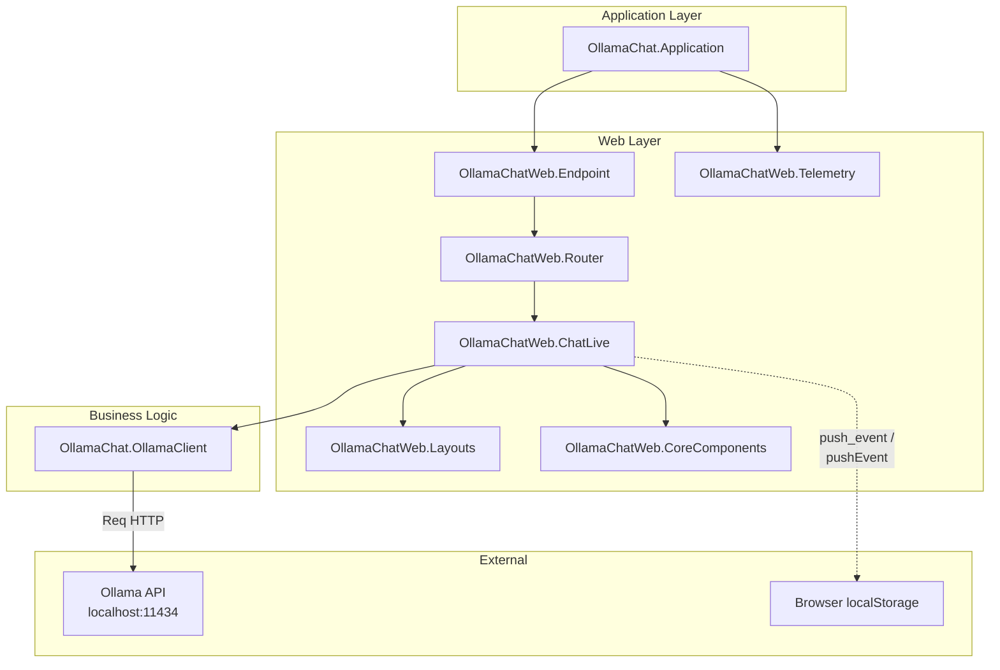

# Module Dependency Graph

```mermaid
graph TD
    subgraph "Application Layer"
        App["OllamaChat.Application"]
    end

    subgraph "Web Layer"
        Endpoint["OllamaChatWeb.Endpoint"]
        Router["OllamaChatWeb.Router"]
        ChatLive["OllamaChatWeb.ChatLive"]
        Layouts["OllamaChatWeb.Layouts"]
        CoreComp["OllamaChatWeb.CoreComponents"]
        Telemetry["OllamaChatWeb.Telemetry"]
    end

    subgraph "Business Logic"
        Client["OllamaChat.OllamaClient"]
    end

    subgraph "External"
        Ollama["Ollama API<br/>localhost:11434"]
        LocalStorage["Browser localStorage"]
    end

    App --> Telemetry
    App --> Endpoint
    Endpoint --> Router
    Router --> ChatLive
    ChatLive --> Client
    ChatLive --> CoreComp
    ChatLive --> Layouts
    Client -->|"Req HTTP"| Ollama
    ChatLive -.->|"push_event /<br/>pushEvent"| LocalStorage
```

The dependency graph is intentionally flat — `ChatLive` is the only module that calls `OllamaClient`, and there are no intermediate service layers or GenServers.
