# Module Dependency Graph

```mermaid
graph TD
    subgraph AppLayer["Application Layer"]
        Application["OllamaChat.Application"]
    end

    subgraph WebLayer["Web Layer"]
        Endpoint["OllamaChatWeb.Endpoint"]
        Router["OllamaChatWeb.Router"]
        ChatLive["OllamaChatWeb.ChatLive"]
        Layouts["OllamaChatWeb.Layouts"]
        CoreComp["OllamaChatWeb.CoreComponents"]
        Telemetry["OllamaChatWeb.Telemetry"]
    end

    subgraph OllamaLayer["Ollama Client"]
        OllamaClient["OllamaChat.OllamaClient<br/>(chat · models · embed · health)"]
    end

    subgraph MCPLayer["MCP Layer"]
        MCPClient["OllamaChat.MCPClient<br/>(GenServer)"]
        MCPRegistry["OllamaChat.MCPRegistry<br/>(ETS)"]
        MCPConfig["OllamaChat.MCPConfig<br/>(JSON persistence)"]
        MCPPromptBuilder["OllamaChat.MCPPromptBuilder"]
        MCPResponseParser["OllamaChat.MCPResponseParser"]
    end

    subgraph ToolLayer["Tool Layer"]
        ToolRouter["OllamaChat.ToolRouter"]
        ToolPromptBuilder["OllamaChat.ToolPromptBuilder"]
        BuiltinTool["OllamaChat.BuiltinTool<br/>(behaviour)"]
        BuiltinRegistry["OllamaChat.BuiltinTools.Registry<br/>(memory save · update · delete · search)"]
    end

    subgraph MemLayer["Memory Layer"]
        Memory["OllamaChat.Memory<br/>(CRUD · search · export · stats)"]
        MemEntry["Memory.Entry<br/>(Ecto schema + pgvector)"]
        MemConvSummary["Memory.ConversationSummary<br/>(Ecto schema)"]
        MemExtractor["Memory.Extractor<br/>(async LLM extraction pipeline)"]
        MemManager["Memory.Manager<br/>(GenServer — scheduled maintenance)"]
    end

    subgraph InfraLayer["Infrastructure"]
        Embeddings["OllamaChat.Embeddings<br/>(generate + store vectors)"]
        Repo["OllamaChat.Repo<br/>(Ecto — PostgreSQL)"]
    end

    subgraph ExtLayer["External Services"]
        OllamaAPI["Ollama API<br/>localhost:11434"]
        PostgreSQL["PostgreSQL + pgvector"]
        MCPServers["MCP Servers<br/>(stdio via ExMCP)"]
        LocalStorage["Browser localStorage"]
    end

    %% Application → supervision children
    Application --> Telemetry
    Application --> Endpoint

    %% Web layer
    Endpoint --> Router
    Router --> ChatLive
    ChatLive --> CoreComp
    ChatLive --> Layouts

    %% ChatLive → service layer
    ChatLive --> OllamaClient
    ChatLive --> MCPClient
    ChatLive --> Memory
    ChatLive --> ToolRouter
    ChatLive --> ToolPromptBuilder
    ChatLive --> BuiltinRegistry
    ChatLive --> Embeddings
    ChatLive -.->|"push_event / pushEvent"| LocalStorage

    %% MCP layer internals
    MCPClient --> MCPRegistry
    MCPClient --> MCPConfig
    MCPClient --> MCPPromptBuilder
    MCPClient --> MCPResponseParser
    MCPClient -->|"stdio (ExMCP)"| MCPServers

    %% Tool layer
    ToolRouter --> MCPClient
    ToolRouter --> BuiltinRegistry
    BuiltinRegistry -.->|"implements"| BuiltinTool

    %% Memory layer
    Memory --> Repo
    Memory --> Embeddings
    Memory --> MemEntry
    Memory --> MemConvSummary
    MemExtractor --> OllamaClient
    MemExtractor --> Embeddings
    MemManager --> Memory

    %% Infrastructure → external
    Embeddings --> OllamaClient
    OllamaClient -->|"HTTP (Finch pool)"| OllamaAPI
    Repo -->|"Ecto / SQL"| PostgreSQL
```

## Layer Summary

| Layer | Modules | Responsibility |
|---|---|---|
| **Web** | `Endpoint`, `Router`, `ChatLive`, `Layouts`, `CoreComponents`, `Telemetry` | HTTP/WebSocket server, LiveView UI, client events |
| **Ollama Client** | `OllamaClient` | Stateless HTTP calls to Ollama — streaming chat, model listing, embedding generation, health checks |
| **MCP** | `MCPClient`, `MCPRegistry`, `MCPConfig`, `MCPPromptBuilder`, `MCPResponseParser` | External tool server lifecycle, discovery, config persistence, message formatting |
| **Tool** | `ToolRouter`, `ToolPromptBuilder`, `BuiltinTool`, `BuiltinTools.Registry` | Route tool calls to MCP or built-in handlers; build tool descriptions for system prompts |
| **Memory** | `Memory`, `Memory.Entry`, `Memory.ConversationSummary`, `Memory.Extractor`, `Memory.Manager` | Persistent long-term memory: CRUD, semantic search, async LLM extraction, scheduled decay |
| **Infrastructure** | `Embeddings`, `Repo` | pgvector embedding generation and storage; Ecto database access |
| **External** | Ollama API, PostgreSQL, MCP Servers, Browser localStorage | Runtime dependencies outside the BEAM process |